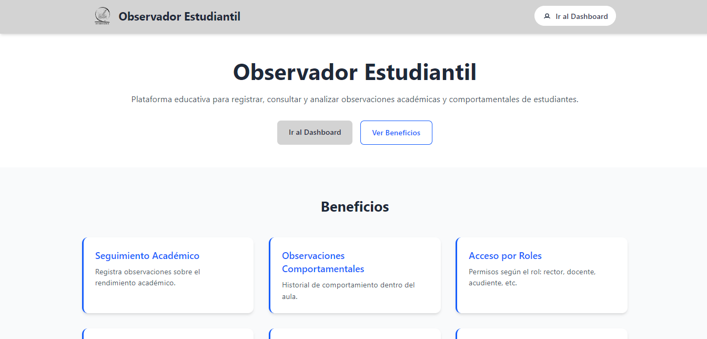

# Observador

**Desarrollado por los aprendices:**
- Jorge Hios
- Karent Vargas
- Diana Mora
- Louis Mosquera

**Supervisado por Instructor:** Héctor David Toledo García

Observador Estudiantil es una plataforma educativa para registrar, consultar y analizar observaciones académicas y comportamentales de estudiantes.


- **Autenticación JWT** (login/registro) con recuperación de contraseña por correo.
- **Roles**: Administrador, Docente y Estudiante con layouts y rutas protegidas.
- **CRUD Usuarios** en panel administrativo.
- **CRUD Observaciones** con carga y vista previa de imágenes.
- **Interfaz responsiva** con TailwindCSS y paleta institucional .

---

## 📂 Estructura del Proyecto

```
root/
├── backend/             # API REST en Node.js + Express
│   ├── controllers/
│   ├── models/
│   ├── routes/
│   ├── config/
│   └── server.js
└── frontend/            # SPA en React + Vite + TailwindCSS
    ├── public/assets/   # Logos e imágenes (logogreen.png, react-logo.png)
    └── src/
        ├── components/
        ├── layouts/     # AdminLayout, UserLayout
        ├── pages/
        ├── App.jsx
        └── main.jsx
```

---

## ⚙️ Instalación y Ejecución

1. **Clonar repositorio**
   ```bash
  https://github.com/Louismosquera99/ObservadorEstudiantil.git
   ```

2. **Instalar dependencias** (en cada carpeta)
   ```bash
   # En la raíz (si usas concurrently)
   npm install

   # Backend
   cd backend
   npm install

   # Frontend
   cd ../frontend
   npm install
   ```

3. **Variables de entorno**
   - **backend/.env**:
     ```env
     PORT=5000
     MONGODB_URI=mongodb://localhost:27017/sigs
     JWT_SECRET=tu_clave_secreta
     EMAIL_USER=tu_correo@gmail.com
     EMAIL_APP_PASS=tu_app_password
     ```
   - **frontend/.env**:
     ```env
     VITE_API_URL=http://localhost:5000/api
     ```

4. **Ejecutar servicios en la raiz del proyecto**
   ```bash
   # Raiz
   npm run dev

   ```

5. Abrir en el navegador `http://localhost:5173`

---

## 🚀 Características

- **Autenticación y roles**: Admin/Docente/Estudiante con rutas protegidas.
- **CRUD Usuarios y Observaciones**: con modales, validación y notificaciones.
- **Observaciones**: gestión completa desde dashboard.
- **Recuperación de contraseña**: envío de link, formulario de reseteo.
- **UI/UX**: responsive, paleta institucional verde/blanco.
- **Feedback**: alertas con React Toastify y diálogos con SweetAlert2.

---

## 📋 API Endpoints Principales

### Autenticación
| Método | Ruta                          | Descripción                          |
|--------|-------------------------------|--------------------------------------|
| POST   | `/api/register`               | Registro de usuario                  |
| POST   | `/api/login`                  | Inicio de sesión                     |
| POST   | `/api/forgot-password`        | Solicitar link de recuperación       |
| POST   | `/api/reset-password/:token`  | Restablecer contraseña               |

### Usuarios (Admin)
| Método | Ruta                   | Descripción            |
|--------|------------------------|------------------------|
| GET    | `/api/users`           | Listar usuarios        |
| PUT    | `/api/users/:id`       | Actualizar usuario     |
| DELETE | `/api/users/:id`       | Eliminar usuario       |

### Observaciones (Admin)
| Método | Ruta                       | Descripción           |
|--------|----------------------------|-----------------------|
| GET    | `/api/productos`           | Listar observaciones     |
| POST   | `/api/productos`           | Crear observacion        |
| PUT    | `/api/productos/:id`       | Editar observacion       |
| DELETE | `/api/productos/:id`       | Eliminar observacion     |

---

## 📸 Capturas de Pantalla


---

## 🤝 Contribuciones

1. Haz fork de este repositorio.
2. Crea rama: `git checkout -b feature/tu-feature`.
3. Realiza cambios y `git commit -m "feat: descripción"`.
4. `git push origin feature/tu-feature`.
5. Abre un Pull Request.

---

## 📄 Licencia

MIT © 2025 SENA
